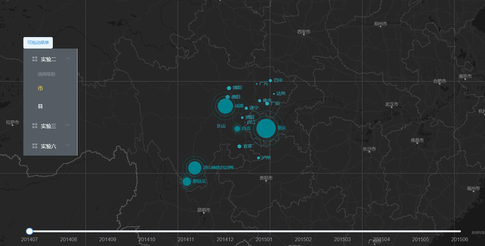
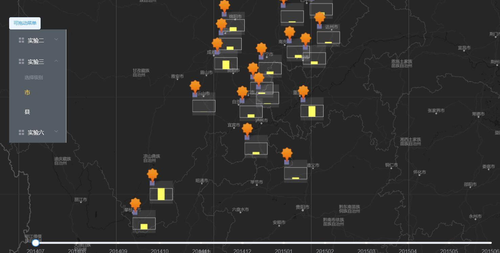

## 1.程序采取的主要框架：
#### 1）后台使用的是node.js的koa框架,使用mvc架构,数据库采用的是postgre,采用前端渲染,后台提供数据接口。
#### 2）前端采用的是vue,地图使用的是leaflet,绘图采用的是echart,ui使用的是element ui。
## 2.主要目录结构
├─koa //存放后台代码
│  │  config.js
│  │  index.js //main
│  │  package.json
│  │  router.js //路由
│  │  start.js
│  │
│  ├─controller
│  │      home.js //控制器
│  │
│  ├─logs //存放日志
│  │
│  ├─middleware //自定义中间件
│  │  │  index.js
│  │  │
│  │  ├─http-error
│  │  │      index.js
│  │  │
│  │  ├─mi-log
│  │  │      access.js
│  │  │      index.js
│  │  │      logger.js
│  │  │
│  │  └─mi-send
│  │          index.js
│  │
│  └─model //模型
│      │  conn.js //连接数据库
│      │  getdata.js //获取数据
│      │  updata.js //更新数据
│      │
│      └─modelTest
│              conn-test.js
│
├─public
│      favicon.ico
│      index.html
│
└─src //前端代码
    │  App.vue
    │  main.js
    │
    ├─assets
    │  │  logo.png
    │  │
    │  └─assets 
    │      ├─css
    │      │      leaflet.extra-markers.css
    │      │
    │      ├─img
    │      │      markers.ai
    │      │      markers_default.png
    │      │      markers_default@2x.png
    │      │      markers_shadow.png
    │      │      markers_shadow@2x.png
    │      │
    │      ├─js
    │      │      leaflet.extra-markers.js
    │      │
    │      ├─less
    │      │      leaflet.extra-markers.less
    │      │
    │      └─svg
    │              marker-circle.svg
    │              marker-penta.svg
    │              marker-square.svg
    │              marker-star.svg
    │
    ├─components //封装的控件
    │      Map.vue //主地图控件
    │      NavMenu.vue //侧边菜单栏控件
    │      TimeSlider.vue //时间轴控件，下同
    │      TimeSlider_3.vue
    │
    └─utils //需要使用js文件
            bus.js 
            echartIcon.js
            echartLayer.js
            echartsIcon.css
            map.js
## 3.具体展示

